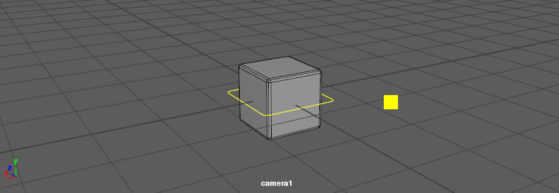
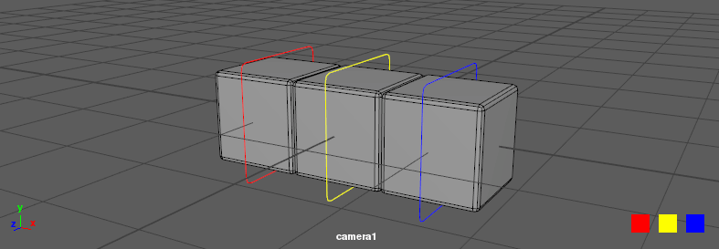
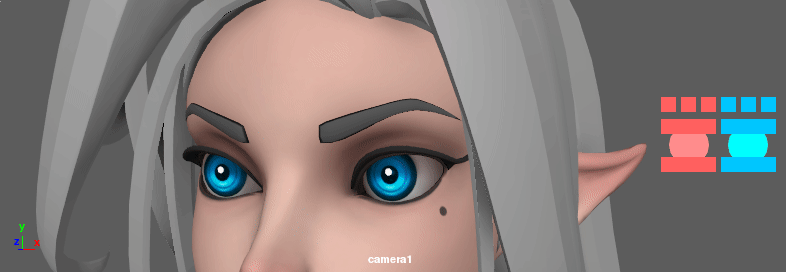

# screenspace
Screenspace is a Maya plugin that allows pickable shapes to be added to transforms and display as if they're attached to the viewport.



Pickables can be styled and offset to your taste. Options include color, position, size, vertical and horizontal alignment, and many more.



Build your own custom interfaces and attach to any rig! <sub>(*Azri rig courtesy of: https://www.gameanim.com/*)</sub>



# Building
You'll need CMake, git, and Maya to build from source. Run the following commands in a shell.

```bash
# Clone the repo
git clone git@github.com:eddiehoyle/screenspace.git

# Build
cd screenspace
mkdir build
cd build
cmake ..
make
```

Once built, check the `plugin` directory for a bunch of directories and files.

```bash
# Add to XBMLANGPATH directory
plugin/icons/out_pickable.png

# Add to MAYA_SCRIPT_PATH directory
plugin/scripts/AEpickableTemplate.mel

# Add to MAYA_PLUG_IN_PATH directory
plugin/screenspace.bundle # OSX
                  .so     # Linux
                  .dll    # Windows
```

See [Maya's plugin installation guide](https://knowledge.autodesk.com/support/maya/learn-explore/caas/CloudHelp/cloudhelp/2018/ENU/Maya-Customizing/files/GUID-FA51BD26-86F3-4F41-9486-2C3CF52B9E17-htm.html) for more information about these paths. 

# Loading

In Maya, go to `Windows > Settings/Preferences` and open the `Plug-in Manager`. Look for the _screenspace_ plugin. Load it and you're all set!

# How to use
Screenspace comes with an `addPickable` command that makes attaching to existing transforms easy.

```python
from maya import cmds
cmds.addPickable(parent="transform1", camera="perspShape")
```

The above example features the _minimum_ required arguments to run this command. You'll need a `parent` to attach the pickable to and a `camera` whose viewports to display the pickable on. Fill in these details to fit your needs.

Here's an example Python script to attach a pickable to a selected transform and the perspective camera.

```python
from maya import cmds
selected = cmds.ls(selected=True, type="transform")
if len(selected) != 1:
    raise ValueError("Please select one transform.")
cmds.addPickable(parent=selected[0], camera="perspShape")
```

## Advanced

The `addPickable` command also supports a bunch of extra options.

```python
cmds.addPickable(parent="transform1",     # Attach pickable to this transform 
                 camera="perspShape",     # Display pickable on this camera's viewports
                 offset=(50.0, 20.0),     # Offset shape position
                 size=20.0,               # Size multiplier
                 width=2.0,               # Width of shape
                 height=2.0,              # Height of shape
                 color=(1.0, 0.0, 0.5),   # Color RGB values (normalised)
                 opacity=0.5,             # Opacity (normalised)
                 position="relative",     # "relative" or "absolute" position
                 verticalAlign="middle",  # "bottom", "middle", or "top" alignment
                 horizontalAlign="left",  # "left", "middle", or "right" alignment
                 depth=0,                 # Ordering. Lower number means higher priority
                 )
```

# Removing
Screenspace also comes with a `removePickables` command. This command attempts to remove any pickables found under current selection, or from a specified transform.

```python
# Remove all pickables from selection
cmds.removePickables(selected=True)

# Remove pickables from 'transform1' node
cmds.removePickables(parent="transform1")
```