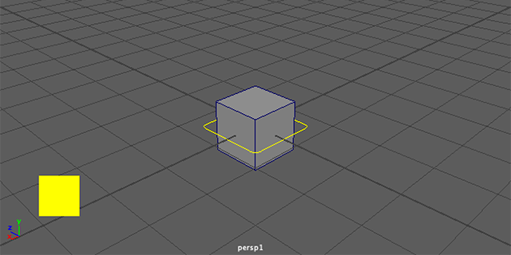
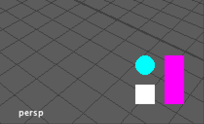
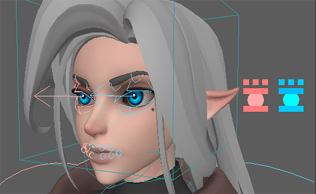

# screenspace
A picker attachment plugin for Maya.

# Contents

1. [Demo](#demo)
2. [How to use](#how-to-use)
3. [Advanced](#advanced)
4. [License](#license)

# Demo

Screenspace allows you to attach pickable shapes to transforms while being displayed in viewport space.



Pickables can be styled and offset to your taste.



Easily build your own pickable interfaces!



# How to use

## Attaching
Screenspace comes with a command to attach pickables to existing transforms.

Mel
```mel
addPickable -parent "..." -camera "...";
```

Python
```python
from maya import cmds
cmds.addPickable(parent="...", camera="...")
```

The examples above feature the minimum required arguments to attach a pickable.

`parent`: The parent *transform* you wish to attach this pickable to.  
`camera`: The camera *shape* you wish to attach this pickable to. The pickable will be visible only for viewports seen through this camera.   

Here's an example Python script of attaching a pickable to the perspective camera and a selected transform.

```python
from maya import cmds
selected = cmds.ls(selected=True)
if len(selected) != 1:
    raise ValueError("Please select one transform.")
cmds.addPickable(parent=selected, camera="perspShape")
```

## Editing

TODO


# Advanced

## Adding

The `addPickable` command supports a bunch of extra options. Run the command with the `-help` flag to see more information.

Mel

```mel
addPickable -help;
```

Python
```python
cmds.addPickable(help=True)
``` 

## Removing

Screenspace also comes with a `removePickables` command. This command attempts to remove any pickables found under current selection.

Mel
```mel
// Remove all pickables from selection
removePickables -sl;

// Remove pickables from transform
removePickables -parent "...";
```

Python
```python
# Remove all pickables from selection
cmds.removePickables(selected=True)

# Remove pickables from transform
cmds.removePickables(parent="...")
```

# License

